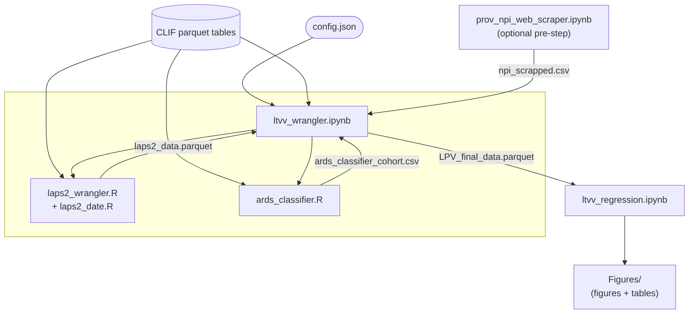

# Provider-Level Variation in Low Tidal Volume Ventilation Adherence

Analysis code for a multilevel study of provider–level variation in low tidal volume ventilation (LTVV) adherence across nine hospitals in the M Health Fairview system, 2011–2025.

## Study Summary

Using cross-classified mixed-effects logistic regression, this study estimates provider-level variation in adherence to lung-protective ventilation (tidal volume ≤6 mL/kg predicted body weight) among a cohort of mechanically ventilated adults enriched for persistent acute hypoxemic respiratory failure (AHRF). Provider-level variation is quantified using median odds ratio (MOR) and intraclass correlation coefficient (ICC).

## Repository Contents

| File | Description |
|------|-------------|
| `ltvv_wrangler.ipynb` | Main data processing pipeline: merges CLIF tables via DuckDB to build the analysis-ready dataset |
| `ltvv_regression.ipynb` | Mixed-effects logistic regression models (R/lme4), figures, and supplementary tables |
| `ards_classifier.R` | Identifies the persistent AHRF cohort from CLIF respiratory support and diagnosis tables |
| `laps2_wrangler.R` | Computes LAPS2 acuity scores for the cohort |
| `laps2_date.R` | LAPS2 scoring function (sourced by `laps2_wrangler.R`) |
| `prov_npi_web_scraper.ipynb` | Scrapes the public NPI registry for provider specialty characteristics |
| `run_ards.bat` | Windows launcher for `ards_classifier.R` |
| `run_laps2.bat` | Windows launcher for `laps2_wrangler.R` |
| `DXCCSR_map.csv` | AHRQ CCSR ICD-10-CM reference table (public) |
| `DXCCSR_naming_convention.csv` | CCSR body-system abbreviation reference (public) |
| `nucc_taxonomy_250.csv` | NUCC provider taxonomy reference (public) |
| `config_template.json` | Template for the required site-specific configuration file |
| `requirements.txt` | Python package dependencies |

## Data

This repository contains **no patient data**. The analysis uses the [Common Longitudinal ICU Format (CLIF)](https://clif-icu.com/) data standard format. CLIF-formatted parquet tables are read from a local path specified in `config.json` (gitignored).

## Setup

### 1. Copy and configure `config.json`

```bash
cp config_template.json config.json
```

Edit `config.json` to set:
- `paths.clif` — path to your CLIF parquet tables directory
- `paths.raw` — path for intermediate outputs
- `paths.db` — path for the DuckDB working database
- `R_timezone` — local timezone string (e.g., `"America/Chicago"`)
- `hospital_id_map` — mapping from your site's raw hospital names to anonymized IDs

### 2. Python environment

Using [uv](https://docs.astral.sh/uv/):

```bash
uv venv .venv
source .venv/bin/activate   # Windows: .venv\Scripts\activate
uv pip install -r requirements.txt
```

Or with standard pip:

```bash
python -m venv .venv
source .venv/bin/activate   # Windows: .venv\Scripts\activate
pip install -r requirements.txt
```

### 3. R environment

Install required R packages. The classifier auto-installs missing packages on first run. Core dependencies:

```r
install.packages(c(
  "lme4", "mice", "arrow", "duckdb", "tidyverse", "data.table",
  "collapse", "lubridate", "dtplyr", "zoo", "fuzzyjoin",
  "powerjoin", "gt", "gtsummary", "broom.mixed", "ggplot2",
  "future.apply", "arm", "pscl", "jsonlite"
))
```

The regression notebook (`ltvv_regression.ipynb`) uses an **R kernel** for Jupyter. Install via:

```r
install.packages("IRkernel")
IRkernel::installspec()
```

### 4. Windows: configure the R launcher scripts

Edit the `RSCRIPT` variable in `run_ards.bat` / `run_laps2.bat`, or set it as an environment variable before running:

```bat
set RSCRIPT=C:\path\to\your\Rscript.exe
run_ards.bat
```

## Pipeline Execution Order

1. **`ltvv_wrangler.ipynb`** — builds `LPV_final_data.parquet`; calls `ards_classifier.R` and `laps2_wrangler.R` internally
2. **`ltvv_regression.ipynb`** — reads `LPV_final_data.parquet`, runs models, writes figures and tables




## License

Code is released under the MIT License. The CLIF data standard is licensed under Apache 2.0.